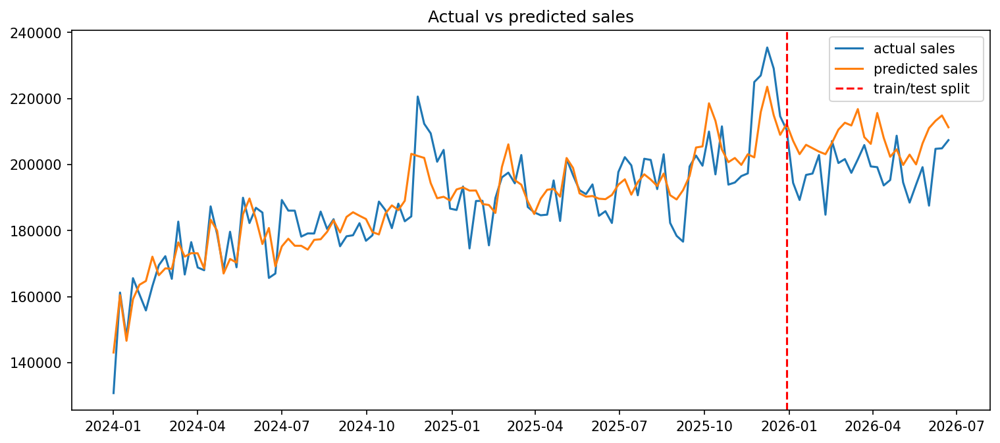

Marketing Mix Modeling: Channel Attribution & Its Limits

What this project does

Builds a Marketing Mix Model (MMM) to estimate how much each marketing channel (TV, paid search, social, email) contributes to weekly sales, using only spend and sales data - the same constraint real analysts face before running paid experiments.

Rather than stopping at "here's a model," this project validates every result against a known ground truth (since the dataset is synthetic, generated with true, hidden contribution values), and documents exactly where the model succeeds and where it hits a real, well-known limitation of regression-based MMM.

Why synthetic data

I generated the underlying dataset myself rather than using a public one, with realistic adstock (carryover), saturation (diminishing returns), seasonality, and promo effects built in, and kept a separate ground-truth file recording the true contribution of each channel. This let me validate the model's output against a known answer, something you can't do with most public MMM datasets.

Method

Adstock transform - models carryover effect per channel (TV lingers longest, email barely lingers at all)
Saturation transform - models diminishing returns per channel
Regression (Ridge, with cross-validated alpha) - estimates each channel's contribution to weekly sales, controlling for a time trend, promo flag, and seasonality (via Fourier terms)
Validation - compared model estimates against the known ground truth, and against held-out weeks (chronological train/test split) to check forecasting accuracy separately from attribution accuracy

Results

Forecasting accuracy: strong. Test MAPE of 4.8% on the final 26 weeks (holdout, never seen during training), close to the 3.3% training MAPE, indicating the model generalizes well and isn't overfitting. (Note: raw R² on the test set was misleadingly negative due to low sales variance in that short window - MAE/MAPE are more reliable here for a small holdout sample.)

Channel attribution accuracy: mixed, and the mixed result is the actual finding.

ChannelModel estimate (avg $/week)True valueResultSearch$24,810$23,741AccurateEmail$4,642$4,651AccurateTV$15,110–$28,845 (varies by method)$39,528Consistently underestimatedSocial$38,755–$39,428 (varies by method)$23,185Consistently overestimated

What I diagnosed

An initial plain regression misattributed credit across channels. Adding seasonality controls (Fourier terms) fixed attribution for search and email, confirming an omitted-variable issue (the model had been crediting spend for sales driven by holiday seasonality).
TV and social attribution remained wrong even after fixing seasonality, tuning saturation curve parameters via optimization, and testing Ridge regression with cross-validated regularization.
Plugging in the true (normally unknown) saturation parameters closed much of TV's gap - confirming saturation curve misspecification was a real, separate source of error - but did not fully resolve it.
The residual TV/social error persists because these channels' spend patterns are correlated enough that regression alone cannot fully separate their individual effects from historical spend and sales data — a documented, structural limitation of regression-based MMM.

Why this matters

This is the exact reason the marketing analytics industry pairs MMM with incrementality testing (e.g., geo-holdout experiments) rather than relying on regression alone: correlational data has a ceiling on what it can resolve, no matter how the model is tuned. This project reproduces that limitation directly, with evidence, rather than assuming it.

What I'd do next with real data

Run or incorporate incrementality/geo-holdout test results as priors to anchor channel coefficients where correlation makes attribution ambiguous
Extend the train/test validation across multiple holdout windows (not just one) for a more robust generalization estimate
Build the interactive Power BI dashboard version of this analysis for stakeholder-facing exploration

Stack

Python, pandas, NumPy, scikit-learn (Ridge/RidgeCV), SciPy (optimization), Matplotlib

Files

data/mmm_weekly_data.csv - synthetic weekly spend (by channel) and sales
data/mmm_ground_truth.csv - true channel contributions (validation only, not used in modeling)
notebooks/mmm_analysis.ipynb - full analysis, from data generation through validation